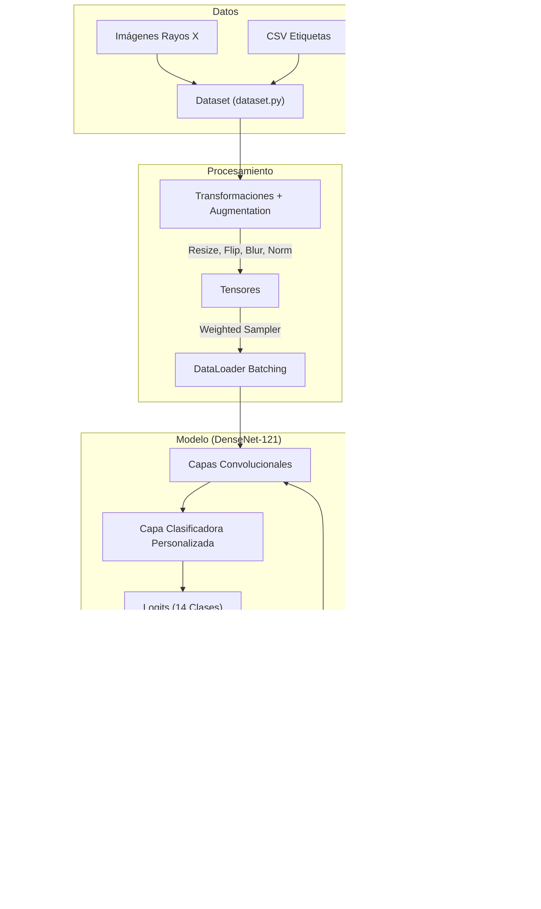

# Documentación del Proyecto: Clasificación de Rayos X de Tórax NIH con DenseNet-121

## 1. Introducción
Este proyecto implementa un sistema de aprendizaje profundo (Deep Learning) para la clasificación multi-etiqueta de 14 patologías torácicas comunes utilizando imágenes de Rayos X. El modelo base es **DenseNet-121**, pre-entrenado en ImageNet, adaptado mediante Transfer Learning.

**Nuevas Características Implementadas:**
*   **Manejo de Desbalance Avanzado:** Uso combinado de **Undersampling** (clase mayoritaria "No Finding") y **WeightedRandomSampler** para forzar lotes equilibrados.
*   **Aumentación de Datos (Data Augmentation):** Aplicación de transformaciones geométricas (Flips, Rotaciones) y filtros de frecuencia (UnsharpMask) para generalización.
*   **Entrenamiento Reanudable (Checkpoints):** Sistema de guardado y carga automática (`checkpoint.pth`) de modelo y optimizador para evitar pérdida de progreso ante interrupciones.
*   **Soporte Multi-Dispositivo Robusto:** Detección de gráficas AMD en Windows vía `torch-directml` con workaround específico para cálculos de pérdida matemáticamente incompatibles.
*   **Métricas y Registro:** Cálculo de **AUC-ROC** y guardado automático en CSV por época.

## 2. Estructura del Proyecto

```
nih_chest_xray_classification/
│
├── main.py                  # Punto de entrada principal para el entrenamiento
├── verify_setup.py          # Script de verificación de entorno
├── requirements.txt         # Dependencias del proyecto
│
└── src/
    ├── data/
    │   └── dataset.py       # Definición de la clase Dataset (Pytorch)
    ├── models/
    │   └── densenet.py      # Definición de la arquitectura del modelo
    └── training/
        └── trainer.py       # Lógica del bucle de entrenamiento y validación
```

## 3. Detalle del Código y Componentes

A continuación se detalla el propósito de cada módulo, función y variable importante.

### 3.1 `main.py`
Es el script orquestador del entrenamiento.

**Constantes de Configuración:**
*   `DATA_DIR`: Ruta al directorio donde se encuentra el dataset (imágenes y CSV).
*   `BATCH_SIZE`: Tamaño del lote de imágenes (ej. 16). Ajustar según la memoria VRAM disponible.
*   `LEARNING_RATE`: Tasa de aprendizaje para el optimizador (ej. 1e-4).
*   `EPOCHS`: Número total de épocas de entrenamiento.
*   `NUM_CLASSES`: 14, correspondiente a las patologías del dataset NIH.
*   `IMAGE_SIZE`: 224, resolución de entrada requerida por DenseNet.
*   `UNDERSAMPLE_RATE`: Fracción (0.0 - 1.0) de la clase "No Finding" a mantener para reducir el desbalance (ej. 0.25).
*   `CSV_FILE`: Nombre del archivo donde se guardarán los resultados detallados del entrenamiento.
*   `CHECKPOINT_FILE`: Archivo (`checkpoint.pth`) para guardar el estado completo y permitir retomar el entrenamiento si se interrumpe.

**Flujo Principal (`main()`):**
1.  **Configuración de Dispositivo**:
    *   Intenta usar **DirectML** (para AMD en Windows) si está disponible (`dml`). Maneja fallos informativos.
    *   Si no, busca **CUDA** (NVIDIA), y por último cae en **CPU**.
2.  **Transformaciones**: Define separadamente las `val_transforms` (Solo redimensionar y normalizar) y las `train_transforms` (Agregando **Data Augmentation** activo como RandomHorizontalFlip, RandomRotation y filtros).
3.  **Carga de Datos**: Instancia `NIHChestXRayDataset` aplicando **undersampling** a la clase "No Finding" según `UNDERSAMPLE_RATE`.
4.  **División**: Separa el dataset en 80% entrenamiento y 20% validación usando `random_split`.
5.  **DataLoaders y Samplers**: 
    *   Crea un `WeightedRandomSampler` que fuerza la aparición de imágenes con patologías raras.
    *   Crea los iteradores de entrenamiento (usando el Sampler) y validación.
6.  **Modelo**: Instancia el modelo (`get_model`).
7.  **Loss y Optimizador**: 
    *   Calcula los pesos del dataset pero los *relaja* con una raíz cuadrada (`torch.sqrt`) para evitar "alucinaciones" al usarse en conjunto con el Sampler inteligente.
    *   Usa el optimizador `Adam`.
8.  **Reanudación Automática**: Revisa si existe `checkpoint.pth` y restablece todo a como estaba (época, pesos, estado adaptativo de Adam).
9.  **Bucle de Entrenamiento**: 
    *   Entrena y valida por épocas.
    *   Mide Loss y **AUC-ROC**.
    *   Guarda métricas (CSV) y sobreescribe el `checkpoint.pth` para proteger el progreso.

### 3.2 `src/data/dataset.py`
Contiene la clase `NIHChestXRayDataset`, encargada de leer las imágenes y procesar las etiquetas.

**Clase `NIHChestXRayDataset`:**
*   `__init__(data_dir, csv_file, transform, images_dir, no_finding_keep_frac)`: Constructor actualizado.
    *   `no_finding_keep_frac`: Controla qué porcentaje de muestras con "No Finding" se conservan. Ayuda a reducir el desbalance extremo de esta clase.
    *   `self.all_labels`: Lista con los nombres de las 14 patologías (Atelectasis, Cardiomegaly, etc.).
    *   `self.image_paths`: Diccionario que mapea el nombre del archivo de imagen a su ruta absoluta en disco.
    *   `self.df`: DataFrame de Pandas filtrado que contiene solo las imágenes encontradas.
*   `__len__()`: Retorna la cantidad total de imágenes disponibles.
*   `__getitem__(idx)`: Método para obtener una muestra.
    *   Carga la imagen usando PIL y la convierte a RGB.
    *   Aplica transformaciones (resize, normalize).
    *   Procesa las etiquetas de texto (ej. "Infiltration|Mass") a un vector One-Hot (ej. `[0, 0, 1, 0, 1, ...]`).
*   `get_pos_weight()`: Nuevo método que calcula los pesos para la función de pérdida.
    *   Devuelve un tensor con el peso para cada clase, calculado como `(N_negativos) / (N_positivos)`. Esto fuerza al modelo a prestar más atención a las patologías reales.

### 3.3 `src/models/densenet.py`
Define la arquitectura del modelo.

**Función `get_model(num_classes, pretrained)`:**
*   Carga `densenet121` de `torchvision.models`.
*   Si `pretrained=True`, carga los pesos aprendidos en ImageNet, lo cual acelera la convergencia y mejora la precisión (Transfer Learning).
*   **Modificación Clave**: Reemplaza la última capa lineal (`classifier`) que originalmente tiene 1000 salidas, por una nueva capa `nn.Linear` con `num_classes` (14) salidas.

### 3.4 `src/training/trainer.py`
Encapsula la lógica de entrenamiento para mantener `main.py` limpio.

**Clase `Trainer`:**
*   `__init(...)`: Guarda referencias al modelo, loaders, criterio y optimizador.
*   `train_one_epoch(epoch)`:
    *   Pone el modelo en modo entrenamiento (`model.train()`).
    *   Itera sobre el `train_loader`.
    *   Realiza el paso forward (predicción), cálculo de loss, backward (gradientes) y optimización (`optimizer.step()`).
    *   Retorna el loss promedio de la época.
*   `validate(epoch)`:
    *   Pone el modelo en modo evaluación (`model.eval()`).
    *   Desactiva el cálculo de gradientes (`torch.no_grad()`) para ahorrar memoria.
    *   Calcula el loss sobre el conjunto de validación.
    *   **Nuevo**: Calcula el AUC-ROC (Area Under the Curve) promedio usando `sklearn.metrics.roc_auc_score` para evaluar la calidad de las predicciones independientemente del umbral de decisión.
    *   Retorna `val_loss` y `val_auc`.

## 4. Diagrama de Funcionamiento

El siguiente diagrama muestra cómo fluyen los datos desde el disco hasta el entrenamiento del modelo.



## 5. Cómo Ejecutarlo

### Requisitos Previos
Asegúrate de tener instalado Python y las dependencias (se recomienda usar un entorno virtual):

```bash
pip install -r requirements.txt
```

*(El archivo `requirements.txt` contiene: torch, torchvision, pandas, pillow, tqdm y torch-directml para AMD)*

### Configuración
Abre `main.py` y verifica las variables de configuración al inicio:

```python
DATA_DIR = r"Ruta\A\Tu\Dataset"  # Ajusta esto a donde descomprimiste el dataset
BATCH_SIZE = 8                 
```

### Ejecutar Entrenamiento
Desde la terminal, en la carpeta raíz del proyecto:

```bash
python main.py
```

El script mostrará el progreso época por época, imprimiendo el Loss de entrenamiento y validación. Al finalizar, guardará el modelo entrenado como `densenet_nih.pth`.
